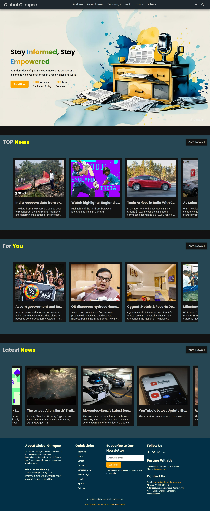
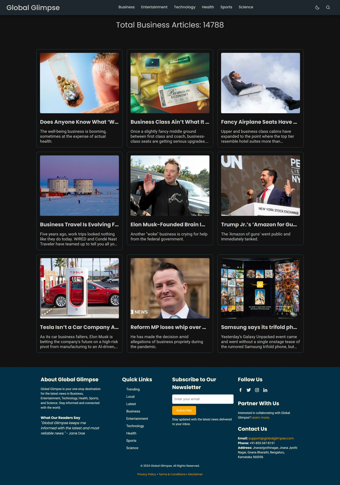
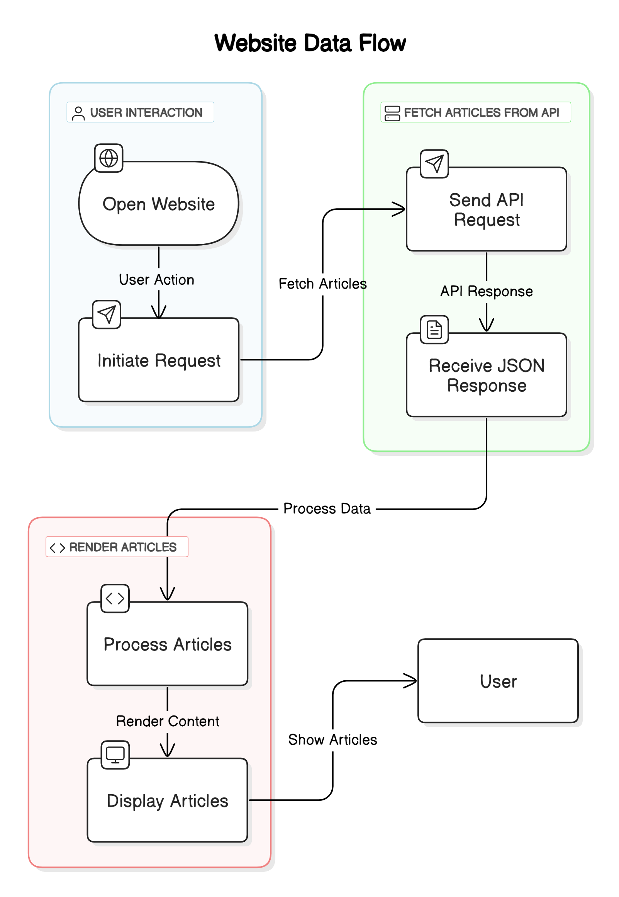

# 🌍 Global Glimpse - Your Gateway to World News

<div align="center">
  
  <h3>Stay Informed, Stay Empowered</h3>
  <p>Your daily dose of global news, empowering stories, and insights to help you stay ahead in a rapidly changing world.</p>
</div>

[](LICENSE)
[](https://github.com/UdayDey0909/Global-Glimpse-News-Website/issues)

[](https://developer.mozilla.org/en-US/docs/Web/HTML)
[](https://developer.mozilla.org/en-US/docs/Web/CSS)
[](https://developer.mozilla.org/en-US/docs/Web/JavaScript)


---

## 📋 Table of Contents

- [✨ Features](#-features)
- [📸 Preview](#-preview)
- [🚀 Quick Start](#-quick-start)
- [🛠️ Troubleshooting](#️-troubleshooting)
- [📁 Project Structure](#-project-structure)
- [🛠️ Technologies & Tools](#️-technologies--tools)
- [🎯 Key Features Deep Dive](#-key-features-deep-dive)
- [🚀 Performance & Optimization](#-performance--optimization)
- [🤝 Contributing](#-contributing)
- [📄 License](#-license)
- [📞 Support & Contact](#-support--contact)

---

## 📸 Preview

### 🏠 Homepage Preview

<div align="center">
  
  <p><em>Main homepage with news categories and featured articles</em></p>
</div>

### 📄 Page Preview

<div align="center">
  
  <p><em>Detailed page layout showing article display and navigation</em></p>
</div>

### 🔄 Application Flow Diagram

<div align="center">
  
  <p><em>Complete application flow and user journey</em></p>
</div>

> **Note**: If images don't display, they may be loading from the repository. The screenshots show the responsive design, dark/light mode toggle, and news article layouts.


---

## ✨ Features

### 🎯 Core Features

- **📰 Live News Feed** - Real-time articles from trusted sources worldwide
- **🏷️ Category Navigation** - Browse news by Business, Entertainment, Technology, Health, Sports, and Science
- **🔍 Smart Search** - Find articles by keywords with instant results
- **📱 Responsive Design** - Perfect experience on mobile, tablet, and desktop
- **🌙 Dark/Light Mode** - Toggle between themes for comfortable reading
- **⚡ Fast Loading** - Optimized performance with smooth animations

### 🎨 User Experience & Quality

- **🎭 Interactive UI** - Hover effects, smooth transitions, and engaging animations
- **📊 News Statistics** - Track article counts and source credibility
- **📧 Newsletter Subscription** - Stay updated with email notifications
- **🔗 Social Media Integration** - Share articles across platforms
- **✅ Verified Sources** - 99% trusted news sources
- **📈 Daily Updates** - 500+ articles published daily
- **🔒 Privacy Focused** - No tracking, clean browsing experience
- **🌐 Global Coverage** - News from around the world

---

## 🚀 Quick Start

### Prerequisites

- Modern web browser (Chrome, Firefox, Safari, Edge)
- Internet connection for API access
- Optional: Local development server

### Installation

1. **Clone the repository**

   ```bash
   git clone https://github.com/UdayDey0909/Global-Glimpse-News-Website.git
   cd Global-Glimpse-News-Website
   ```

2. **API Key Setup** (Optional - Free key included)

   ```bash
   # A free NewsAPI key is already included for quick testing
   # If you want to use your own key, register at https://newsapi.org/
   # and replace the key in src/data/config.js
   ```

3. **Launch the application**

   ```bash
   # Option 1: Open index.html directly in your browser
   # Option 2: Use a local server (recommended)
   npx live-server
   # or
   python -m http.server 8000
   # or
   php -S localhost:8000
   ```

4. **Access the application**

   ```
   Open your browser and navigate to:
   http://localhost:8000 (if using local server)
   or simply open index.html in your browser
   ```

---

## 🛠️ Troubleshooting

### Common Issues

#### 1. **API Rate Limit Exceeded**

```
Error: "rateLimited" or "429 Too Many Requests"
```

**Solution**:

- The included free API key has a 1000 requests/day limit
- Register for your own free key at <https://newsapi.org/> for personal use
- Implement caching for repeated requests
- Consider upgrading your API plan for higher limits

#### 2. **Images Not Loading**

```
Error: CORS policy blocking images
```

**Solution**:

- Use a proxy service for images
- Implement fallback images
- Check image URLs for validity

#### 3. **Search Not Working**

```
Error: Search results empty
```

**Solution**:

- The included API key has rate limits (1000 requests/day for free tier)
- If you hit the limit, register for your own key at <https://newsapi.org/>
- Check network connectivity
- Ensure search query is not empty

#### 4. **Dark Mode Not Persisting**

```
Error: Theme resets on page refresh
```

**Solution**:

- Check localStorage is enabled
- Verify JavaScript is running
- Clear browser cache

### Browser Compatibility

| Browser | Version | Status            |
| ------- | ------- | ----------------- |
| Chrome  | 90+     | ✅ Full Support    |
| Firefox | 88+     | ✅ Full Support    |
| Safari  | 14+     | ✅ Full Support    |
| Edge    | 90+     | ✅ Full Support    |
| IE      | 11      | ⚠️ Limited Support |

---

## 📁 Project Structure

```
Global-Glimpse/
├── 📄 index.html                 # Main entry point with auto-redirect
├── 📖 README.md                  # Project documentation
├── 📁 src/                       # Source code directory
│   ├── 📁 pages/                 # HTML pages
│   │   ├── 🏠 HomePage.html      # Main homepage
│   │   ├── 💼 Business.html      # Business news
│   │   ├── 🎭 Entertainment.html # Entertainment news
│   │   ├── 💻 Technology.html    # Technology news
│   │   ├── 🏥 Health.html        # Health news
│   │   ├── ⚽ Sports.html         # Sports news
│   │   ├── 🔬 Science.html       # Science news
│   │   ├── 📰 topNews.html       # Top trending news
│   │   ├── 🆕 latestNews.html    # Latest news
│   │   ├── 👤 forYou.html        # Personalized news
│   │   ├── 🔍 searchResult.html  # Search results
│   │   ├── 🤝 partnerships.html  # Partnership information
│   │   ├── 📋 privacyPolicy.html # Privacy policy
│   │   ├── 📜 Terms&Conditions.html # Terms and conditions
│   │   └── ⚖️ Disclaimer.html    # Legal disclaimer
│   ├── 🎨 css/                   # Stylesheets
│   │   ├── 🏠 HomePage.css       # Homepage styles
│   │   ├── 🎨 style.css          # Global styles
│   │   ├── 🧭 nav.css            # Navigation styles
│   │   └── 📰 blog.css           # Article styles
│   ├── ⚡ js/                     # JavaScript files
│   │   ├── 🏠 script.js          # Main functionality
│   │   ├── 💼 Business.js        # Business page logic
│   │   ├── 🎭 Entertainment.js   # Entertainment page logic
│   │   ├── 💻 Technology.js      # Technology page logic
│   │   ├── 🏥 Health.js          # Health page logic
│   │   ├── ⚽ Sports.js           # Sports page logic
│   │   ├── 🔬 Science.js         # Science page logic
│   │   ├── 📰 topNews.js         # Top news logic
│   │   ├── 🆕 latestNews.js      # Latest news logic
│   │   ├── 👤 forYou.js          # Personalized news logic
│   │   └── 🔍 Search.js          # Search functionality
│   ├── ⚙️ data/                   # Configuration
│   │   └── ⚙️ config.js          # API configuration
│   ├── 🖼️ assets/                 # Images and media
│   │   ├── 📸 Fallback_Image.jpg
│   │   ├── 🖼️ Mobile_Hero_Section.jpeg
│   │   ├── 🖼️ Newspaper_1.jpg
│   │   ├── 🖼️ Newspaper2.jpg
│   │   ├── 🏠 HomePage-Preview.jpeg
│   │   ├── 📄 Page-Preview.jpeg
│   │   └── 🔄 Flow-Diagram.png
│   └── 🌐 public/                 # Public assets
│       ├── 🖼️ heroSection.jpeg   # Hero background
│       └── 🎯 icon.png           # Website icon
└── 📁 .vscode/                   # VS Code configuration
```

---

## 🛠️ Technologies & Tools

### Frontend Technologies

- **🌐 HTML5** - Semantic markup and structure
- **🎨 CSS3** - Modern styling with Flexbox and Grid
- **⚡ JavaScript (ES6+)** - Dynamic functionality and API integration
- **📱 Responsive Design** - Mobile-first approach

### External APIs & Services

- **📰 NewsAPI.org** - Real-time news data
- **🎨 Boxicons** - Beautiful icon library
- **🌐 Google Fonts** - Typography (Poppins, Roboto)

### Development Tools

- **🔧 VS Code** - Code editor with extensions
- **🚀 Live Server** - Local development server
- **📦 Git** - Version control

---

## 🎯 Key Features Deep Dive

### 📰 News Categories

- **Business** - Market trends, economy, and corporate news
- **Entertainment** - Movies, music, celebrities, and culture
- **Technology** - Tech innovations, startups, and digital trends
- **Health** - Medical breakthroughs, wellness, and healthcare
- **Sports** - Athletic events, teams, and sports analysis
- **Science** - Research discoveries, space, and scientific breakthroughs

### 🔍 Search Functionality

- **Instant Search** - Real-time results as you type
- **Keyword Matching** - Find articles by title, content, or author
- **Filtered Results** - Search within specific categories
- **Search History** - Track your recent searches

### 📱 Responsive Design

- **Mobile-First** - Optimized for smartphones and tablets
- **Desktop Experience** - Full-featured interface for larger screens
- **Touch-Friendly** - Easy navigation on touch devices
- **Fast Loading** - Optimized images and assets

---

## 🚀 Performance & Optimization

### Loading Speed

- **Optimized Images** - Compressed and properly sized
- **Minified CSS/JS** - Reduced file sizes
- **Lazy Loading** - Images load as needed
- **Caching** - Browser caching for faster repeat visits

### SEO & Accessibility

- **Semantic HTML** - Proper heading structure and landmarks
- **Meta Tags** - Optimized for search engines
- **Alt Text** - Descriptive image alt attributes for screen readers
- **Clean URLs** - SEO-friendly page structure
- **Keyboard Navigation** - Full keyboard accessibility support
- **ARIA Labels** - Enhanced screen reader compatibility
- **Color Contrast** - WCAG compliant color schemes
- **Focus Indicators** - Clear focus states for navigation

---

## 🤝 Contributing

We welcome contributions from the community! Here's how you can help:

### 🐛 Reporting Bugs

1. Check existing issues to avoid duplicates
2. Create a detailed bug report with steps to reproduce
3. Include browser version and device information

### 💡 Suggesting Features

1. Open an issue with the "enhancement" label
2. Describe the feature and its benefits
3. Provide mockups or examples if possible

### 🔧 Code Contributions

1. Fork the repository
2. Create a feature branch
3. Commit your changes
4. Push to the branch
5. Open a Pull Request

### 📝 Code Style & Guidelines

- Follow existing code formatting and naming conventions
- Add comments for complex logic and functions
- Test your changes thoroughly across different browsers
- Update documentation if needed
- Ensure responsive design works on all screen sizes
- Validate HTML and CSS before submitting

---

## 📄 License

This project is licensed under the **MIT License** - see the [LICENSE](LICENSE) file for details.

---

## 📞 Support & Contact

### 📧 Get in Touch

- **Email**: [uday-dey-work@gmail.com](mailto:uday-dey-work@gmail.com)
- **LinkedIn**: [Uday Dey](https://www.linkedin.com/in/uday-dey-76a066345/)
- **Twitter**: [@uday_dey_work](https://twitter.com/uday_dey_work)

### 🐛 Reporting Issues

- **GitHub Issues**: Use the [Issues tab](https://github.com/UdayDey0909/Global-Glimpse-News-Website/issues) for bug reports
- **Feature Requests**: Open an issue with the "enhancement" label
- **Questions**: Feel free to email or create a discussion in GitHub

### 🤝 Contributing Guidelines

- Fork the repository and create a feature branch
- Follow the existing code style and conventions
- Test your changes thoroughly
- Submit a pull request with a clear description

## 🙏 Acknowledgments

- **NewsAPI.org** for providing reliable news data
- **Boxicons** for the beautiful icon library
- **Google Fonts** for typography
- **Contributors** who help improve this project
- **Users** who provide valuable feedback

---

<div align="center">
  <h3>🌟 Star this repository if you find it helpful!</h3>
  <p>Made with ❤️ by <a href="mailto:uday-dey-work@gmail.com">Uday Dey</a></p>
  <p><em>Stay informed, stay empowered with Global Glimpse!</em></p>
</div>
